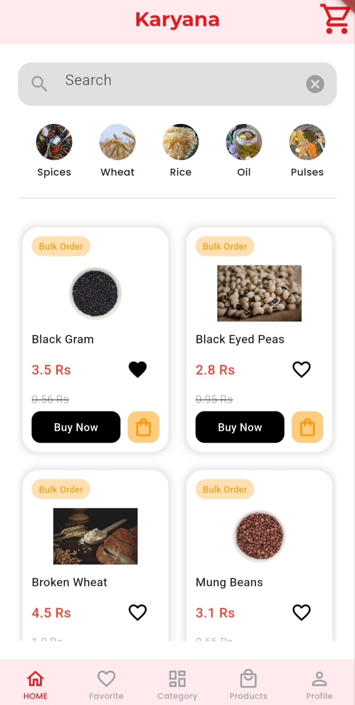
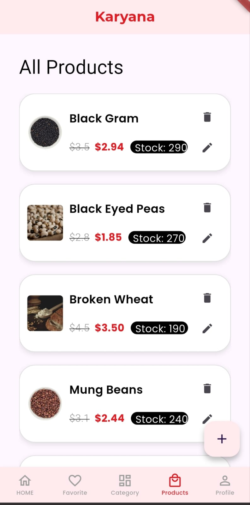

# Karyana Store — Flutter E-Commerce App

A full-featured grocery shopping app built with 
Flutter and Firebase. Product browsing, cart 
management, order processing, and real-time 
inventory tracking — cross-platform on iOS 
and Android.

## Screenshots

  
  &nbsp;&nbsp;&nbsp;&nbsp;&nbsp;&nbsp;&nbsp;&nbsp;
  
  &nbsp;&nbsp;&nbsp;&nbsp;&nbsp;&nbsp;&nbsp;&nbsp;
  

## Features
- Product catalog with category filtering
- Cart management with real-time updates
- Order processing and tracking
- Firebase authentication
- Real-time inventory sync
- Responsive UI across all screen sizes

## Tech Stack
- Flutter & Dart
- Firebase Firestore
- Firebase Authentication
- REST APIs

## Getting Started
Clone the repo and run flutter pub get.
Requires Firebase project setup.
